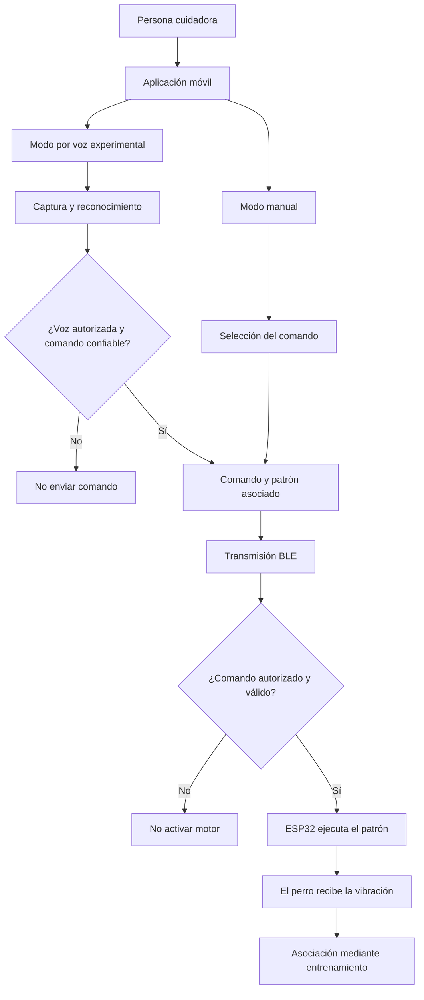

# 🐶 SmartLeash

## Sistema inteligente de comunicación asistida para perros con pérdida auditiva

SmartLeash es un prototipo de comunicación asistida diseñado para que perros con pérdida auditiva reciban señales mediante patrones de vibración.

La solución completa contempla dos modalidades: selección manual de comandos desde una aplicación móvil y reconocimiento de palabras clave mediante inteligencia artificial.

Su arquitectura combina una aplicación móvil, comunicación Bluetooth Low Energy (BLE), un microcontrolador ESP32 y un motor vibrador.

SmartLeash no pretende restaurar la audición: propone un canal alternativo de comunicación cuyo significado se construye mediante entrenamiento, asociación y refuerzo positivo.

**La población objetivo actual son perros con pérdida auditiva. Las personas cuidadoras son usuarias del sistema.**

> “Porque la comunicación siempre ha existido; SmartLeash la adapta a las nuevas necesidades de tu mejor amigo.”

---

## 🎯 Objetivo

Desarrollar un sistema que permita:

- Seleccionar comandos desde una aplicación móvil.
- Reconocer palabras clave mediante inteligencia artificial como segunda modalidad de interacción.
- Asociar cada comando con un patrón háptico diferenciado.
- Transmitir los comandos mediante Bluetooth Low Energy.
- Recibir los comandos en un ESP32.
- Activar un motor con el patrón correspondiente.
- Construir asociaciones entre señales y conductas mediante refuerzo positivo.
- Mantener el modo manual como alternativa al reconocimiento por voz.
- Incorporar privacidad, ciberseguridad y bienestar animal desde el diseño.

---

## 🐕 Origen del proyecto

SmartLeash nace a partir de las necesidades de comunicación de **Fea**, una perrita con pérdida auditiva.

El propósito es ofrecer una forma de transmitir señales cuando la comunicación verbal no resulta accesible y las señales visuales no son suficientes.

El proyecto está dirigido actualmente a **perros con pérdida auditiva**. No se plantea como un dispositivo médico que restaure la audición ni como una solución que garantice obediencia.

---

## 💡 Problema

La pérdida auditiva puede dificultar la recepción de señales verbales durante actividades cotidianas.

La comunicación visual también tiene limitaciones cuando:

- El perro no está mirando a la persona.
- Existen obstáculos que interrumpen el contacto visual.
- Hay poca iluminación.
- Aparecen distractores en el entorno.
- La persona necesita llamar la atención del perro sin depender exclusivamente de la voz.

SmartLeash propone complementar las señales visuales con patrones de vibración asociados a comandos.

La recepción de una vibración no implica que el perro conozca automáticamente su significado: esa asociación requiere entrenamiento y validación.

---

## ✅ Solución propuesta: dos modalidades

La solución completa de SmartLeash contempla dos formas de seleccionar un comando:

| Modalidad | Interacción de la persona | Papel dentro del proyecto |
|---|---|---|
| **Manual** | Selecciona un comando mediante botones en la aplicación | Alcance principal del MVP |
| **Por voz** | Pronuncia una palabra clave que el modelo busca reconocer | Componente experimental con integración completa pendiente |

Ambas modalidades convergen en el mismo flujo:

**Comando → patrón háptico → comunicación BLE → ESP32 → vibración.**

El perro recibe el patrón de vibración asociado al comando, independientemente de si la selección se originó mediante un botón o mediante voz.

El reconocimiento por voz forma parte de la solución completa desde su concepción. Durante el proyecto se realizaron actividades experimentales de preparación de datos, entrenamiento, predicción y simulación.

---

## 🧭 Casos de uso

Los siguientes casos describen el funcionamiento previsto de la solución. No representan por sí mismos pruebas de integración completa ni resultados conductuales validados.

### Modo manual: selección directa y mayor control

Durante un paseo, la persona quiere indicar que es momento de continuar y selecciona **“Vámonos”** desde la aplicación.

También puede utilizar esta modalidad cuando:

- Prefiere no hablar.
- Existe ruido que dificulta el reconocimiento de voz.
- El modelo no identifica una instrucción con suficiente confianza.
- Quiere seleccionar directamente el comando durante una sesión de entrenamiento.

El modo manual evita depender del reconocimiento de voz, pero sigue requiriendo una conexión operativa con el collar y el resto del sistema.

### Modo por voz: interacción sin seleccionar cada botón

Con la modalidad por voz habilitada, la persona pronuncia **“Vámonos”** hacia el teléfono.

El flujo previsto reconoce la palabra, verifica las condiciones de autorización y validez, y la relaciona con el mismo patrón utilizado en el modo manual.

Esta modalidad busca facilitar la interacción cuando tocar la pantalla resulta menos práctico. No implica escucha permanente ni funcionamiento sin una activación y configuración adecuadas.

### Entrenamiento y asociación

La persona activa una señal y acompaña el ejercicio con una indicación conocida y refuerzo positivo.

Mediante sesiones graduales se evalúa si el perro logra asociar cada patrón con la conducta correspondiente.

### Evaluación experimental del caso de separación

Se contempla investigar si una señal previamente aprendida podría ayudar a llamar la atención del perro ante una separación accidental cercana.

Este caso depende de:

- Que el dispositivo permanezca dentro del alcance efectivo de BLE.
- Que exista conexión entre la aplicación y el collar.
- Que ambos dispositivos tengan alimentación.
- Que la señal haya sido entrenada.
- Que el perro responda en las condiciones reales del entorno.

**SmartLeash no es un localizador GPS ni un sistema antiescape. No sustituye la correa, la supervisión ni otras medidas de seguridad.**

---

## 📌 Alcance actual

> La aplicación, el firmware y el prototipo físico existen. La integración App → BLE → ESP32 → motor se encuentra en revalidación.

El proyecto distingue entre:

- Funciones implementadas.
- Funciones parciales o con incidencias conocidas.
- Integraciones en revalidación.
- Trabajo experimental.
- Requisitos de arquitectura.
- Funciones previstas para etapas posteriores.

El modo manual delimita el alcance principal del MVP.

El componente de voz cuenta con experimentación previa; su integración completa con la aplicación y el collar permanece pendiente.

Las medidas de ciberseguridad descritas en este documento representan requisitos y controles previstos, salvo que exista evidencia específica de su implementación y validación.

---

## 📱 Comandos manuales y patrones del firmware

El firmware documentado utiliza los siguientes identificadores:

| ID | Comando | Propósito previsto | Patrón programado |
|---|---|---|---|
| `1` | **Vámonos** | Señal relacionada con iniciar o continuar el movimiento | Una vibración de 300 ms |
| `2` | **Fea** | Señal para llamar la atención de Fea | Dos vibraciones de 200 ms, separadas por 200 ms |
| `3` | **Quieta** | Señal relacionada con permanecer quieta | Una vibración de 1000 ms |

Estos patrones describen la programación del firmware. No constituyen una validación de su eficacia conductual ni de su adecuación para todos los perros.

Los patrones deberán revisarse mediante pruebas técnicas y de bienestar animal.

> “Quieta” forma parte de los comandos manuales actuales. No se presenta como una clase entrenada e integrada en el componente experimental de voz.

### Configuración en la aplicación y ejecución física

La gestión de comandos y patrones en la aplicación debe distinguirse de su ejecución en el collar.

El firmware documentado reconoce tres identificadores y ejecuta patrones predefinidos. Crear o modificar un comando en la aplicación no demuestra que el firmware pueda recibir y ejecutar automáticamente cualquier patrón personalizado.

La correspondencia entre configuración de la aplicación, identificadores BLE y patrones del firmware forma parte de la validación de integración.

---

## 📲 Modo manual — MVP

En esta modalidad, la persona selecciona el comando desde la aplicación.

### Flujo previsto

1. Abre la aplicación.
2. Selecciona el perfil del perro.
3. Establece la conexión con el collar.
4. Selecciona un comando.
5. La aplicación identifica el comando y su patrón asociado.
6. Transmite el identificador mediante BLE.
7. El ESP32 interpreta el identificador.
8. El motor ejecuta el patrón programado.
9. El perro recibe la señal.
10. La asociación se construye mediante entrenamiento y refuerzo positivo.

### Funciones desarrolladas en la aplicación

- Interfaz móvil con React Native.
- Pantallas de acceso y registro local.
- Creación y administración de perfiles de perros.
- Incorporación de nombre y fotografía.
- Edición y eliminación de perfiles.
- Gestión de comandos.
- Configuración de patrones en la aplicación.
- Persistencia local mediante AsyncStorage.
- Pantalla de conexión.
- Exploración de dispositivos BLE con validación parcial.
- Pantalla de historial con implementación parcial.

### Incidencias y límites conocidos

- Se reportó que el registro de una nueva cuenta puede sobrescribir el nombre sin separar correctamente los datos del perfil anterior. El aislamiento entre cuentas requiere revisión.
- El acceso local no debe interpretarse como un sistema de autenticación de producción.
- La pantalla de historial requiere verificar qué registros proceden de eventos reales y cuáles corresponden a datos de demostración.
- Una vibración generada por el teléfono no demuestra que el collar haya recibido o ejecutado el comando.
- La exploración de dispositivos BLE no equivale a validar el envío completo de comandos al ESP32.

---

## 🧠 Inteligencia artificial

### Reconocimiento de palabras clave

El componente experimental de IA busca identificar palabras clave y relacionarlas con comandos del sistema.

### Clases trabajadas experimentalmente

Durante las pruebas se utilizaron:

| Clase | Función dentro del experimento |
|---|---|
| `fea` | Reconocimiento del nombre utilizado para llamar la atención |
| `vamonos` | Reconocimiento de la palabra asociada al comando |
| `silencio` | Clase auxiliar para distinguir ausencia de una instrucción |
| `otro` | Clase auxiliar para sonidos o palabras fuera de las clases objetivo |

Las clases `silencio` y `otro` no se presentan como comandos hápticos para el perro. Su tratamiento debe impedir activaciones indebidas.

### Trabajo realizado

- Organización de muestras de audio.
- Carga del conjunto de datos.
- Preparación de clases.
- Entrenamiento experimental.
- Ejecución de predicciones.
- Pruebas con archivos de audio.
- Simulación del flujo voz → comando → patrón háptico.

### Reconocimiento de palabras y autorización de voz

Reconocer **qué palabra se pronunció** no equivale a verificar **quién la pronunció**.

Entrenar el modelo con grabaciones de una persona no garantiza que rechace la misma palabra pronunciada por alguien más.

La solución contempla evaluar un mecanismo independiente de verificación de hablante y autorización de cuidadores.

Por ejemplo, si una persona ajena dice “Fea” cerca del teléfono, el diseño debe buscar evitar que esa palabra active el collar sin autorización.

### Flujo de voz previsto

1. La persona habilita la modalidad de voz mediante un mecanismo explícito.
2. La aplicación captura el audio.
3. El modelo procesa la señal.
4. Se identifica una palabra candidata.
5. Se evalúan confianza, autorización y condiciones de activación.
6. Si la instrucción no cumple las condiciones, no se envía un comando.
7. Si cumple las condiciones, se selecciona el patrón correspondiente.
8. Se transmite el comando mediante BLE.
9. El ESP32 ejecuta el patrón.

Este flujo describe la arquitectura propuesta, no una integración completamente validada.

### Trabajo pendiente

- Ampliar y depurar el conjunto de datos.
- Separar datos de entrenamiento y evaluación.
- Documentar métricas reproducibles.
- Evaluar falsos positivos y falsos negativos.
- Probar diferentes ambientes, distancias al micrófono y niveles de ruido.
- Evaluar voces autorizadas y no autorizadas.
- Definir umbrales de confianza.
- Evitar activaciones ante silencio o palabras ajenas a los comandos.
- Evaluar activación explícita mediante botón o frase de activación.
- Integrar el modelo con la aplicación.
- Conectar la predicción con el envío BLE.
- Validar el flujo completo con el collar.
- Evaluar nombres personalizados y nuevos comandos.
- Mantener el modo manual como alternativa.

No se presentan métricas definitivas de precisión hasta completar una evaluación reproducible.

### IA para análisis y personalización del entrenamiento

Como línea futura, se contempla estudiar si los registros de sesiones permiten:

- Identificar patrones de respuesta.
- Analizar la evolución de las asociaciones.
- Detectar dificultades recurrentes.
- Apoyar recomendaciones de entrenamiento individualizado.

Esta línea requiere datos reales, criterios de bienestar animal y validación. No se presenta como una función actualmente implementada ni como una capacidad para interpretar pensamientos o emociones del perro.

---

## 🔄 Arquitectura general

El diagrama muestra la arquitectura objetivo. Las verificaciones de autorización y seguridad representan controles previstos.



> La integración App → BLE → ESP32 → motor permanece en revalidación. El reconocimiento de voz cuenta con trabajo experimental; su integración completa y los controles de autorización permanecen como siguientes etapas.

---

## 🖼️ Flujo visual del sistema

La siguiente infografía presenta las dos modalidades contempladas por SmartLeash y distingue el MVP manual del trabajo experimental de reconocimiento de voz.


> La imagen representa la arquitectura del proyecto. La respuesta conductual requiere entrenamiento y evidencia real. La infografía debe mantenerse alineada con los estados técnicos descritos en este README.

---

## ⚙️ Hardware y sistema embebido

El prototipo documentado contempla:

- Microcontrolador ESP32.
- Motor vibrador tipo moneda de 8 mm.
- Transistor NPN 2N2222.
- Resistencia de 1 kΩ.
- Diodo 1N4007.
- Batería LiPo de 3.7 V.
- Módulo cargador TP4056.
- Convertidor elevador MT3608 ajustado a 5 V.
- Interruptor de encendido y apagado.
- Placa para montaje.
- Carcasa de protección.

La compatibilidad eléctrica, alimentación y límites de cada componente deben verificarse con sus especificaciones.

**El ajuste del convertidor a 5 V no implica que cualquier motor vibrador de 8 mm admita ese voltaje.**

### Repositorio del firmware

[Firmware SmartLeash ESP32](https://github.com/LOLA-1980/SmartLeash-ESP32)

### Control del motor

El firmware utiliza el **GPIO 32** como señal de control.

El GPIO se conecta a la base del transistor mediante una resistencia. El transistor conmuta la corriente del motor; el motor no debe alimentarse directamente desde el GPIO.

El circuito contempla un diodo de protección en paralelo con el motor.

Esta descripción es funcional y no sustituye un esquema eléctrico completo ni la comprobación de polaridades, conexiones y especificaciones.

### Estado técnico

- Circuito y ensamble físico: desarrollados.
- Firmware: desarrollado.
- Carga del firmware: documentada.
- Funcionamiento del ESP32 mediante USB: documentado.
- Comunicación completa App → BLE → ESP32: en revalidación.
- Activación del motor desde la aplicación: en revalidación.
- Funcionamiento autónomo con batería: pendiente de validación.
- Autonomía, temperatura, comodidad y resistencia: pendientes de evaluación.

---

## 🔐 Ciberseguridad y privacidad

La seguridad busca proteger el canal completo de comunicación:

**Persona cuidadora → aplicación → BLE → collar → señal recibida por el perro.**

Una activación no autorizada o repetida puede afectar tanto la confianza en el sistema como el bienestar del animal.

### Arquitectura propuesta

Los siguientes elementos son requisitos y controles previstos. No deben interpretarse como medidas completamente implementadas, auditadas o certificadas en el MVP.

### 1. Autorización de personas y voces

- Distinguir reconocimiento de palabras y verificación de hablante.
- Evaluar el registro de cuidadores autorizados.
- Permitir revocar autorizaciones.
- Evaluar rechazo de voces desconocidas.
- Evitar que una palabra detectada baste por sí sola para activar el collar.
- Evaluar riesgos de grabaciones reproducidas o imitaciones de voz.
- Mantener mecanismos adicionales de autorización y control desde la aplicación.

La verificación de voz no debe considerarse infalible ni utilizarse como única barrera de seguridad.

### 2. Activaciones accidentales y falla segura

- Evaluar activación explícita del modo de escucha.
- Definir umbrales de confianza.
- Rechazar instrucciones ambiguas o no reconocidas.
- Evitar comandos ante silencio o audio ajeno a las clases objetivo.
- Limitar repeticiones y frecuencia de activación.
- Definir una acción de cancelación o detención.
- Evitar ejecutar comandos antiguos al recuperar una conexión.

**Principio de diseño: si la instrucción no es válida o no está autorizada, el collar no debe vibrar.**

### 3. Protección de la comunicación BLE

- Autenticar y autorizar la comunicación entre aplicación y collar.
- Evaluar e implementar mecanismos de cifrado adecuados para BLE.
- Establecer un procedimiento de emparejamiento seguro.
- Validar los clientes que pueden enviar comandos.
- Proteger la integridad de los mensajes.
- Evaluar mecanismos contra la repetición de mensajes capturados.
- Rechazar identificadores y formatos no admitidos.
- Controlar conexiones no autorizadas.
- Definir el comportamiento ante desconexiones.

Bluetooth Low Energy proporciona comunicación inalámbrica de corto alcance, pero no garantiza por sí mismo la seguridad del sistema.

### 4. Cuentas, credenciales y datos

- Revisar el aislamiento de datos entre cuentas.
- Evitar almacenar contraseñas en texto plano.
- Utilizar almacenamiento adecuado para secretos y credenciales.
- No considerar AsyncStorage como un almacén seguro de secretos.
- Aplicar minimización de datos.
- Definir plazos de conservación y mecanismos de eliminación.
- Solicitar únicamente los permisos necesarios.

El nombre del perro puede conocerse públicamente o escucharse durante un paseo. **No debe utilizarse como contraseña, PIN, secreto de emparejamiento ni prueba de autorización.**

### 5. Privacidad del audio

- Priorizar procesamiento local cuando resulte técnicamente viable.
- Informar cuándo se captura audio y con qué finalidad.
- Evitar escucha o grabación innecesarias.
- Proteger grabaciones y representaciones de voz.
- Obtener las autorizaciones necesarias para utilizar muestras de otras personas.
- Evaluar los requisitos aplicables si se incorporan servicios externos.
- Permitir eliminar los datos de voz asociados al usuario.

### 6. Firmware, modelo y registros

- Evaluar actualizaciones seguras del firmware.
- Verificar integridad y procedencia de las actualizaciones.
- Proteger los archivos del modelo contra modificaciones no autorizadas.
- Registrar eventos relevantes sin exponer datos sensibles.
- Evitar que los registros almacenen contraseñas o audio innecesario.
- Documentar pruebas de seguridad y limitaciones conocidas.

### 7. Límites de activación háptica

- Implementar límites de duración y frecuencia.
- Evitar activaciones continuas o acumuladas.
- Establecer un comportamiento seguro ante errores.
- Evaluar mecanismos de control de intensidad en futuras versiones.

El prototipo documentado programa principalmente duración y secuencia temporal. No se afirma que exista control validado de intensidad variable.

---

## ⚠️ Riesgos y limitaciones

| Riesgo o limitación | Consideración |
|---|---|
| Pérdida de conexión BLE | El comando puede no llegar al collar |
| Alcance inalámbrico variable | Depende del entorno, obstáculos y dispositivos |
| Batería insuficiente | Puede impedir el funcionamiento |
| Reconocimiento erróneo de voz | Requiere evaluación, umbrales y rechazo de instrucciones |
| Voz de una persona no autorizada | Requiere controles específicos de autorización |
| Reproducción de audio grabado | La verificación de hablante por sí sola puede ser insuficiente |
| Comandos repetidos o manipulados | Requiere protección del canal y validación de mensajes |
| Registro local con incidencias | No debe presentarse como autenticación de producción |
| Historial parcial | No todos los datos mostrados constituyen evidencia de eventos reales |
| Diferencias entre app y firmware | La configuración visual no garantiza ejecución física equivalente |
| Ausencia de entrenamiento | La vibración no tiene significado automático para el perro |
| Respuesta conductual variable | No puede garantizarse obediencia ni respuesta inmediata |
| Incomodidad o estrés | Requiere evaluación gradual y suspensión ante señales de malestar |
| Alimentación y montaje | Requiere revisión de voltajes, temperatura y protección física |

### Límites del alcance

- No restaura la audición.
- No sustituye atención veterinaria ni orientación profesional.
- No es un sistema GPS.
- No garantiza evitar escapes.
- No sustituye la correa ni la supervisión.
- No garantiza que el perro responda ante una situación de peligro.
- No se plantea como herramienta de castigo.
- No se extiende actualmente a personas, gatos u otras especies.

---

## 🧪 Entrenamiento con el perro

Cada patrón necesita adquirir significado mediante asociación y refuerzo positivo.

### Proceso propuesto

1. Validar primero el funcionamiento técnico y los límites de activación.
2. Evaluar la comodidad y adecuación del dispositivo.
3. Introducir las señales de forma gradual.
4. Asociar un patrón con una indicación y una conducta.
5. Reforzar positivamente la respuesta.
6. Mantener sesiones breves y supervisadas.
7. Registrar resultados y señales de malestar.
8. Ajustar o suspender el ejercicio cuando corresponda.

Las pruebas deben priorizar el bienestar del perro y contar con orientación profesional cuando sea necesaria.

SmartLeash transmite una señal; la asociación con una conducta debe construirse y comprobarse.

---

## 🔬 Validación conductual

Las siguientes preguntas permanecen abiertas hasta contar con evidencia real:

- ¿Fea distingue consistentemente los patrones?
- ¿Las asociaciones se mantienen con el tiempo?
- ¿Agregar señales aumenta la confusión?
- ¿Cuánto entrenamiento requiere una señal nueva?
- ¿Puede establecerse una cantidad de patrones adecuada para diferentes perros?

Los resultados se documentarán con los estados:

**Pendiente → En evaluación → Resultado observado.**

Se registrarán las condiciones de prueba, repeticiones, respuestas observadas y posibles distractores.

**No se atribuirá comprensión consistente ni eficacia generalizable antes de contar con evidencia suficiente.**

---

## ⚖️ Consideraciones legales y de uso responsable

La evolución del proyecto contempla revisar los requisitos aplicables en México en materia de:

- Protección de datos personales.
- Avisos de privacidad y consentimiento cuando corresponda.
- Tratamiento de grabaciones y datos utilizados para verificar voces.
- Bienestar animal.
- Información al consumidor.
- Seguridad del producto.
- Requisitos técnicos y regulatorios para una eventual comercialización.
- Propiedad intelectual y licencias de software, modelos y recursos.

Estas consideraciones no equivalen a una certificación ni a una declaración de cumplimiento legal completo.

Antes de una comercialización se requiere una revisión especializada acorde con las características finales del producto.

---

## 💼 Enfoque comercial

La propuesta de valor consiste en ofrecer un canal de comunicación háptica para perros con pérdida auditiva, operado por sus cuidadores mediante una aplicación.

La visión comercial contempla:

- Dispositivo háptico.
- Aplicación móvil.
- Dos modalidades de interacción: manual y por voz.
- Orientación para entrenamiento y uso responsable.
- Privacidad y seguridad desde el diseño.

La validación comercial deberá evaluar:

- Necesidades de las personas cuidadoras.
- Disposición de pago.
- Costos de componentes, ensamble y carcasa.
- Costos de pruebas, soporte y mantenimiento.
- Canales de distribución.
- Viabilidad financiera.

No se presentan en este README precios definitivos, ventas, certificaciones ni resultados comerciales no documentados.

---

## 🛠️ Tecnologías utilizadas

### Aplicación móvil

- React Native.
- Expo.
- Expo Router.
- TypeScript.
- AsyncStorage.
- Integración Bluetooth Low Energy.

### Inteligencia artificial

- Python.
- TensorFlow.
- Procesamiento de audio.
- Reconocimiento de palabras clave.
- Entrenamiento y predicción de modelos.

### Hardware y firmware

- ESP32.
- Arduino IDE.
- C/C++.
- Bluetooth Low Energy.
- Electrónica y sistemas embebidos.

### Desarrollo y documentación

- Git.
- GitHub.
- Visual Studio Code.
- Notion como herramienta interna de documentación.

---

## 📂 Repositorios del proyecto

| Repositorio | Contenido |
|---|---|
| [SmartLeash](https://github.com/LOLA-1980/smartleash) | Aplicación móvil y módulos experimentales de IA |
| [SmartLeash ESP32](https://github.com/LOLA-1980/SmartLeash-ESP32) | Firmware y control del motor |

### Organización de referencia

Los principales directorios y archivos descritos en la documentación son:

| Ruta | Contenido |
|---|---|
| `app/` | Pantallas, navegación y lógica de la aplicación |
| `components/` | Componentes reutilizables |
| `constants/` | Configuración y estilos compartidos |
| `assets/` | Recursos visuales |
| `ai/` | Datos y scripts experimentales de voz |
| `ai/training/` | Carga de datos, entrenamiento y predicción |
| `ai_research/` | Recursos de investigación experimental |
| `smartleash_engine/` | Experimentación con el flujo del sistema |
| `docs/` | Recursos públicos de documentación |
| `requirements.txt` | Dependencias del entorno Python |
| `package.json` | Dependencias y scripts de la aplicación |

La disponibilidad y organización exacta deben comprobarse en la versión del repositorio que se utilice.

---

## 🚀 Instalación y ejecución

### Requisitos generales

- Git.
- Node.js compatible con la versión de Expo del proyecto.
- npm.
- Python compatible con las dependencias del módulo de IA.
- pip.
- Dispositivo móvil compatible para pruebas.
- Entorno de desarrollo nativo cuando se requieran módulos BLE.

La documentación de desarrollo utiliza Node.js 20 y Python 3.10 como referencias del entorno.

### Consideración sobre Expo Go y BLE

Expo Go puede utilizarse únicamente con las funciones y dependencias que admita su entorno.

Las bibliotecas BLE que requieren código nativo no incluido en Expo Go necesitan una compilación de desarrollo compatible.

Abrir la interfaz en Expo Go no demuestra que la comunicación BLE con el collar pueda ejecutarse desde ese entorno.

---

## 📱 Ejecutar la aplicación móvil

### 1. Clonar el repositorio

```bash
git clone https://github.com/LOLA-1980/smartleash.git
```

### 2. Entrar en el proyecto

```bash
cd smartleash
```

### 3. Instalar dependencias

```bash
npm install
```

### 4. Iniciar el servidor de desarrollo

```bash
npx expo start
```

### 5. Iniciar con limpieza de caché si es necesario

```bash
npx expo start --clear
```

### Para una compilación de desarrollo

Si ya existe una compilación de desarrollo instalada y compatible con las dependencias nativas:

```bash
npx expo start --dev-client
```

Este comando inicia el servidor para ese cliente. No crea ni instala por sí mismo la compilación nativa.

Las pruebas BLE requieren revisar permisos, compatibilidad del teléfono, configuración nativa y disponibilidad del collar.

---

## 🧠 Ejecutar el módulo experimental de IA

### 1. Crear un entorno virtual

En Windows:

```powershell
py -3.10 -m venv venv310
```

### 2. Activar el entorno virtual

```powershell
.\venv310\Scripts\Activate.ps1
```

### 3. Instalar dependencias

```powershell
pip install -r requirements.txt
```

### 4. Revisar la carga del conjunto de datos

```powershell
python ai/training/dataset_loader.py
```

### 5. Entrenar el modelo

```powershell
python ai/training/train_model.py
```

### 6. Ejecutar una predicción

```powershell
python ai/training/predict.py
```

Si la versión del script utiliza la variable `test_file`, el archivo de prueba puede configurarse mediante una ruta relativa:

```python
test_file = "ai/training/audioTest/test_vamonos2.wav"
```

La ejecución requiere disponer del conjunto de datos, los archivos de prueba y los modelos que espere cada script.

Los resultados dependen de las clases configuradas y del entrenamiento realizado. Una predicción aislada no constituye una evaluación completa del modelo.

---

## 🔒 Archivos y datos que no deben publicarse

Como base, el archivo `.gitignore` debe excluir:

```gitignore
node_modules/
.expo/
venv310/
.venv/
__pycache__/
*.pyc
.env
.env.*
!.env.example
dist/
build/
```

Además, antes de publicar se debe revisar que no se incluyan:

- Contraseñas.
- Claves de API.
- Tokens.
- Credenciales.
- Grabaciones personales sin autorización.
- Datos privados de usuarios.
- Registros con información sensible.
- Documentación interna no destinada a publicación.

Los datos y modelos destinados a publicarse requieren una revisión de privacidad y licencias.

> Agregar un archivo a `.gitignore` no elimina versiones previamente incorporadas al historial de Git.

---

## ✅ Resultados documentados

Durante el desarrollo se trabajó en:

- Definición del problema y la solución.
- Diseño de una arquitectura con dos modalidades.
- Desarrollo de la aplicación móvil.
- Pantallas de acceso y registro local.
- Gestión de perfiles de perros.
- Gestión de comandos y patrones en la aplicación.
- Persistencia local.
- Pantalla de historial parcial.
- Exploración BLE y pantalla de conexión.
- Diseño y ensamble del prototipo electrónico.
- Desarrollo y carga del firmware.
- Programación de tres patrones hápticos.
- Pruebas iniciales de componentes.
- Preparación de datos de voz.
- Entrenamiento y predicciones experimentales.
- Simulación del flujo voz → comando → patrón.
- Definición de requisitos de privacidad y ciberseguridad.
- Diseño de una metodología de entrenamiento.
- Documentación técnica y preparación de materiales de presentación.

La integración física completa continúa en revalidación. La validación conductual requiere pruebas reales documentadas.

---

## 📊 Estado del proyecto

| Componente | Estado |
|---|---|
| Interfaz y navegación móvil | 🟢 Desarrolladas |
| Acceso y registro local | 🟡 Con incidencia reportada de aislamiento entre cuentas |
| Perfiles de perros | 🟢 Desarrollados |
| Gestión de comandos en la aplicación | 🟢 Desarrollada |
| Configuración de patrones en la aplicación | 🟢 Desarrollada; correspondencia con firmware por validar |
| Historial | 🟡 Parcial; verificar registros reales y de demostración |
| Exploración BLE | 🟡 Parcial |
| Firmware ESP32 | 🟢 Desarrollado y con carga documentada |
| Ensamble físico | 🟢 Construido; funcionamiento integrado en revalidación |
| App → BLE → ESP32 → motor | 🟠 En revalidación |
| Funcionamiento autónomo con batería | ⚪ Pendiente de validación |
| Reconocimiento de palabras clave | 🔵 Experimental |
| Integración de voz con aplicación y collar | ⚪ Pendiente |
| Verificación de hablante | 🔵 Control propuesto |
| Ciberseguridad | 🔵 Arquitectura y requisitos propuestos |
| Personalización del entrenamiento mediante IA | 🔵 Línea futura de investigación |
| Entrenamiento con Fea | ⚪ Pendiente/en preparación |
| Validación conductual | ⚪ Pendiente |
| Evaluación del caso de separación | 🔵 Investigación futura |
| Validación comercial | ⚪ Pendiente |

### Leyenda

- 🟢 Desarrollado o implementado en el alcance indicado.
- 🟡 Parcial o con incidencias conocidas.
- 🟠 En revalidación.
- 🔵 Experimental, propuesto o futuro.
- ⚪ Pendiente.

El estado de un componente no implica que todo el sistema esté validado de extremo a extremo.

---

## 🗺️ Próximas etapas

### 1. Cerrar la validación técnica del MVP

- Revisar las incidencias de acceso y separación de datos.
- Verificar que el historial refleje eventos reales.
- Confirmar la correspondencia entre comandos de la app e identificadores del firmware.
- Revalidar la comunicación App → BLE → ESP32.
- Confirmar la ejecución física de los tres patrones.
- Probar alimentación autónoma, autonomía y comportamiento ante desconexiones.
- Documentar resultados reproducibles.

### 2. Evolucionar el reconocimiento por voz

- Ampliar y depurar datos.
- Evaluar ruido, voces y condiciones de uso.
- Documentar métricas y errores.
- Integrar el modelo con la aplicación.
- Evaluar autorización de cuidadores y verificación de hablante.
- Definir umbrales y mecanismos de activación explícita.
- Mantener el modo manual como alternativa.

### 3. Implementar y evaluar ciberseguridad

- Definir amenazas y requisitos.
- Implementar autenticación y autorización.
- Evaluar e implementar cifrado adecuado para BLE.
- Incorporar protección contra repetición de mensajes.
- Validar comandos y establecer falla segura.
- Proteger credenciales y datos de voz.
- Evaluar actualizaciones seguras.
- Realizar pruebas y registrar limitaciones.

### 4. Validar bienestar y respuesta conductual

- Implementar límites seguros de duración y frecuencia de activación.
- Evaluar mecanismos de control de intensidad en futuras versiones.
- Comprobar comodidad y adecuación del dispositivo.
- Iniciar entrenamiento gradual y supervisado.
- Registrar respuestas, distractores y señales de malestar.
- Documentar resultados sin atribuir comprensión antes de contar con evidencia suficiente.

### 5. Explorar personalización mediante IA

- Definir qué datos de entrenamiento son necesarios.
- Recopilar datos reales con criterios de privacidad.
- Evaluar si permiten apoyar recomendaciones individualizadas.
- Comparar resultados antes de atribuir beneficios.

### 6. Evaluar experimentalmente el caso de separación

- Delimitar condiciones de uso.
- Medir alcance y estabilidad de la conexión.
- Evaluar la señal en entornos controlados.
- Mantener supervisión y medidas físicas de seguridad.
- No presentar el sistema como localizador ni solución antiescape.

### 7. Avanzar hacia validación comercial

- Validar necesidades con cuidadores de perros con pérdida auditiva.
- Revisar costos y viabilidad financiera.
- Evaluar requisitos legales y técnicos.
- Preparar un piloto controlado.
- Ajustar la propuesta de valor con evidencia.

---

## 📄 Documentación y recursos públicos

Los materiales del proyecto incluyen:

- Resumen Ejecutivo.
- Presentación Final.
- README de la aplicación.
- README del firmware.
- Infografía del flujo.
- Video pitch y demostración.

Los enlaces a documentos y video se incorporarán cuando sus versiones públicas estén disponibles.

### Repositorios públicos

- [SmartLeash — Aplicación e IA experimental](https://github.com/LOLA-1980/smartleash)
- [SmartLeash ESP32 — Firmware](https://github.com/LOLA-1980/SmartLeash-ESP32)

La documentación interna, bitácoras completas y evidencias privadas no se publican íntegramente en este README.

---

## 👩‍💻 Autora

**Lillys Hernández Ramos**

Ingeniera en Sistemas Computacionales  
Creadora y desarrolladora de SmartLeash

- GitHub: [LOLA-1980](https://github.com/LOLA-1980)
- Aplicación: [SmartLeash](https://github.com/LOLA-1980/smartleash)
- Firmware: [SmartLeash ESP32](https://github.com/LOLA-1980/SmartLeash-ESP32)

**SmartLeash — 2026**

---

## 💙 Frase del proyecto

> “Porque la comunicación siempre ha existido; SmartLeash la adapta a las nuevas necesidades de tu mejor amigo.”
