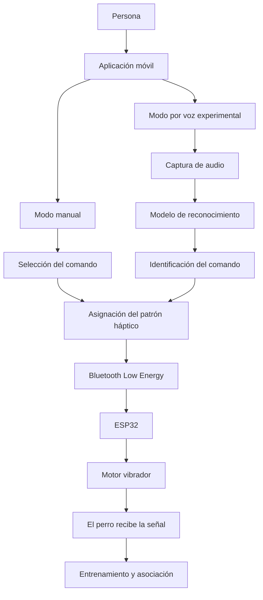
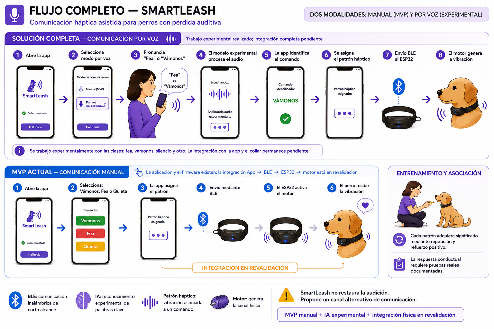

# 🐶 SmartLeash

## Sistema inteligente de comunicación asistida para perros con pérdida auditiva

SmartLeash es un prototipo de comunicación asistida diseñado para que perros con pérdida auditiva reciban señales mediante patrones de vibración.

El sistema integra una aplicación móvil, comunicación Bluetooth Low Energy (BLE), un microcontrolador ESP32 y un motor vibrador. SmartLeash no pretende restaurar la audición: propone un canal alternativo cuyo significado se construye mediante entrenamiento, asociación y refuerzo positivo.

> “Porque la comunicación siempre ha existido; SmartLeash la adapta a las nuevas necesidades de tu mejor amigo.”

---

## 🎯 Objetivo

Desarrollar un sistema que permita:

- Seleccionar comandos desde una aplicación móvil.
- Asociar cada comando con un patrón háptico diferente.
- Enviar los comandos mediante Bluetooth Low Energy.
- Recibirlos en un ESP32.
- Activar un motor con el patrón correspondiente.
- Enseñar al perro el significado de cada vibración mediante refuerzo positivo.
- Incorporar reconocimiento de voz como parte de la evolución completa del proyecto.
- Integrar principios de privacidad y ciberseguridad desde el diseño.

---

## 🐕 Origen del proyecto

SmartLeash nace a partir de las necesidades de comunicación de **Fea**, una perrita con pérdida auditiva.

El propósito es que Fea pueda recibir señales diferenciadas mediante un dispositivo háptico, incluso cuando no puede escuchar la voz de la persona que la acompaña.

El proyecto está dirigido actualmente a **perros con pérdida auditiva**.

---

## 💡 Problema

Los perros con pérdida auditiva no siempre pueden responder a señales verbales, especialmente cuando:

- No están mirando directamente a la persona.
- Se encuentran a cierta distancia.
- Hay poca iluminación.
- Existen distractores en el entorno.
- La comunicación visual no es suficiente.

SmartLeash propone complementar las señales visuales con patrones de vibración diferenciados.

---

## ✅ Solución propuesta

La solución completa de SmartLeash contempla dos modalidades:

1. **Modo manual:** la persona selecciona un comando desde la aplicación.
2. **Modo por voz:** la aplicación reconoce una palabra clave mediante inteligencia artificial y la transforma en un comando háptico.

El **modo manual** delimita el alcance principal del MVP.

El **reconocimiento por voz** forma parte de la solución completa desde su concepción. Durante el proyecto se realizaron actividades experimentales de preparación de datos, entrenamiento, predicción y simulación. Su integración completa con la aplicación, BLE, ESP32 y collar permanece como siguiente etapa.

---

## 📌 Alcance actual

> La aplicación, el firmware y el prototipo físico existen. La integración App → BLE → ESP32 → motor se encuentra actualmente en revalidación.

SmartLeash diferencia claramente entre:

- Lo implementado.
- Lo parcialmente implementado.
- Lo que está en revalidación.
- El trabajo experimental.
- Las funciones previstas para etapas posteriores.

---

## 📱 Comandos actuales

El prototipo trabaja con los siguientes comandos:

| ID | Comando | Propósito |
|---|---|---|
| `1` | **Vámonos** | Señal relacionada con iniciar o continuar el movimiento |
| `2` | **Fea** | Señal para llamar la atención de Fea |
| `3` | **Quieta** | Señal relacionada con permanecer quieta |

Cada comando puede asociarse con un patrón háptico diferente.

> “Quieta” forma parte de los comandos manuales actuales. No se presenta como clase integrada en el modelo de voz mientras no haya sido entrenada y validada dentro de ese componente.

---

## 📲 Modo manual — MVP

En el modo manual, la persona selecciona el comando desde la aplicación.

### Flujo previsto

1. La persona abre la aplicación.
2. Selecciona un compañero.
3. Selecciona un comando.
4. La aplicación identifica el patrón asociado.
5. El comando se transmite mediante BLE.
6. El ESP32 recibe el identificador.
7. El motor genera el patrón de vibración.
8. El perro recibe la señal.
9. La asociación se construye mediante entrenamiento y refuerzo positivo.

### Funciones de la aplicación

- Login y registro local.
- Creación y administración de perfiles de perros.
- Agregar nombre y fotografía.
- Editar y eliminar perfiles.
- Crear, editar y eliminar comandos.
- Asociar comandos con diferentes patrones de vibración.
- Persistencia local mediante AsyncStorage.
- Interfaz móvil desarrollada con React Native.
- Exploración de dispositivos BLE.
- Pantalla de conexión.
- Historial de actividad en implementación parcial.

---

## 🧠 Reconocimiento de voz — Componente experimental de IA

El componente de inteligencia artificial busca identificar palabras clave y convertirlas en comandos hápticos.

### Flujo diseñado

1. La persona pronuncia una palabra clave.
2. La aplicación captura el audio.
3. El modelo procesa la señal.
4. La IA clasifica el audio.
5. La aplicación identifica el comando correspondiente.
6. Se asigna un patrón háptico.
7. El comando se transmite al ESP32.
8. El collar activa la vibración.

### Clases trabajadas experimentalmente

Durante las pruebas del modelo se utilizaron las clases:

- `fea`
- `vamonos`
- `silencio`
- `otro`

### Trabajo realizado

- Organización de muestras de audio.
- Carga del conjunto de datos.
- Preparación de clases.
- Entrenamiento experimental.
- Ejecución de predicciones.
- Pruebas con archivos de audio.
- Simulación del flujo voz → comando → vibración.

### Trabajo pendiente

- Ampliar y depurar el conjunto de datos.
- Evaluar el modelo con métricas documentadas.
- Realizar pruebas con diferentes voces y ambientes.
- Analizar el efecto del ruido.
- Integrar el modelo con la aplicación móvil.
- Conectar la predicción con el envío BLE.
- Validar el flujo completo con el collar.
- Evaluar la personalización del nombre de cada perro.

No se presentan métricas definitivas de precisión hasta completar una evaluación reproducible.

---

## 🔄 Arquitectura general



> La integración completa entre la aplicación, BLE, ESP32 y motor permanece en revalidación. El reconocimiento por voz cuenta con trabajo experimental de entrenamiento y predicción; su integración completa permanece pendiente.

---

## 🖼️ Flujo visual del sistema

La siguiente imagen presenta las dos modalidades contempladas por SmartLeash y diferencia el alcance del MVP manual del trabajo experimental de reconocimiento por voz.



> El diagrama representa la arquitectura del proyecto. La integración física App → BLE → ESP32 → motor permanece en revalidación y la respuesta conductual requiere entrenamiento y evidencia real.

---

## ⚙️ Hardware y sistema embebido

SmartLeash utiliza los siguientes componentes:

- Microcontrolador ESP32.
- Motor vibrador tipo moneda de 8 mm.
- Transistor NPN 2N2222.
- Resistencia de 1 kΩ.
- Diodo 1N4007.
- Batería LiPo de 3.7 V.
- Módulo cargador TP4056.
- Convertidor elevador MT3608 ajustado a 5 V.
- Interruptor de encendido y apagado.
- Placa para montaje.
- Carcasa para proteger el circuito.

### Repositorio del firmware

El código desarrollado para el ESP32 se encuentra en un repositorio independiente:

- [Firmware SmartLeash ESP32](https://github.com/LOLA-1980/SmartLeash-ESP32)

### Control del motor

La señal de control utiliza el GPIO 32:

```text
GPIO 32
   ↓
Resistencia de 1 kΩ
   ↓
Base del transistor 2N2222
   ↓
Motor vibrador
```

El transistor permite controlar el motor sin exigir directamente al GPIO la corriente necesaria para activarlo.

### Estado técnico

- Circuito electrónico: desarrollado.
- Ensamble físico: desarrollado.
- Firmware del ESP32: desarrollado.
- Carga del firmware: realizada.
- Placa funcional mediante USB: confirmada.
- Exploración BLE desde la aplicación: parcial.
- Comunicación completa App → BLE → ESP32: pendiente de revalidación.
- Activación del motor mediante el flujo completo: pendiente de revalidación.
- Funcionamiento autónomo con batería: pendiente de validación.

---

## 🔐 Ciberseguridad y privacidad

La ciberseguridad forma parte del diseño y evolución de SmartLeash.

### Requisitos contemplados

- Procesamiento local del audio cuando sea técnicamente posible.
- Minimización de la recopilación de datos.
- Protección de grabaciones de voz.
- Autenticación entre aplicación y collar.
- Emparejamiento seguro.
- Protección de comandos enviados mediante BLE.
- Manejo seguro de sesiones y credenciales.
- Almacenamiento protegido del modelo.
- Registro controlado de eventos.
- Actualización segura del firmware.

> Estos elementos representan requisitos y criterios de diseño. No deben interpretarse como controles completamente implementados, auditados o certificados dentro del MVP.

Bluetooth Low Energy proporciona un canal inalámbrico de corto alcance, pero no garantiza por sí mismo la seguridad completa del sistema.

---

## 🧪 Entrenamiento con el perro

Cada patrón de vibración necesita adquirir significado mediante asociación y refuerzo positivo.

### Proceso propuesto

1. Activar un patrón de vibración.
2. Presentar la conducta o señal correspondiente.
3. Reforzar positivamente la respuesta.
4. Repetir el ejercicio gradualmente.
5. Evitar sesiones demasiado largas.
6. Registrar los resultados observados.

SmartLeash no garantiza automáticamente una respuesta conductual. El dispositivo transmite la señal; su significado debe construirse mediante entrenamiento.

---

## 🔬 Validación conductual

Las siguientes preguntas permanecen abiertas hasta contar con evidencia real:

- ¿Fea distingue consistentemente los patrones?
- ¿Las asociaciones se mantienen con el tiempo?
- ¿Agregar señales aumenta la confusión?
- ¿Cuánto entrenamiento requiere una señal nueva?
- ¿Existe una cantidad de patrones adecuada para diferentes perros?

Los resultados se documentarán utilizando:

```text
Pendiente → En evaluación → Resultado observado
```

No se afirmará que Fea comprende consistentemente los comandos hasta finalizar el entrenamiento y registrar evidencia suficiente.

---

## 🛠️ Tecnologías utilizadas

### Aplicación móvil

- React Native
- Expo
- Expo Router
- TypeScript
- AsyncStorage
- Bluetooth Low Energy

### Inteligencia artificial

- Python
- TensorFlow
- Procesamiento de audio
- Reconocimiento de palabras clave
- MFCC y/o espectrogramas
- Entrenamiento y predicción de modelos

### Hardware y firmware

- ESP32
- Arduino IDE
- C/C++
- Bluetooth Low Energy
- Electrónica básica
- Sistemas embebidos

### Desarrollo y documentación

- Git
- GitHub
- Visual Studio Code
- Notion

---

## 📂 Repositorios del proyecto

SmartLeash está organizado en dos repositorios:

| Repositorio | Contenido |
|---|---|
| [SmartLeash](https://github.com/LOLA-1980/smartleash) | Aplicación móvil y módulo experimental de inteligencia artificial |
| [SmartLeash ESP32](https://github.com/LOLA-1980/SmartLeash-ESP32) | Firmware del sistema embebido y control del motor |

---

## 📂 Estructura general

```text
smartleash-app/
│
├── ai/
│   ├── dataset/
│   └── training/
│       ├── dataset_loader.py
│       ├── train_model.py
│       ├── predict.py
│       └── audioTest/
│
├── ai_research/
│
├── app/
│   ├── (auth)/
│   ├── (tabs)/
│   ├── contexts/
│   ├── dog/
│   ├── styles/
│   ├── connect.tsx
│   ├── history.tsx
│   ├── index.tsx
│   ├── modal.tsx
│   ├── settings.tsx
│   ├── splash.tsx
│   ├── train.tsx
│   └── _layout.tsx
│
├── assets/
│   └── images/
│
├── components/
│   └── ui/
│
├── constants/
│   └── theme.ts
│
├── docs/
│   └── flujo-completo-smartleash.png
│
├── hooks/
│
├── models/
│
├── scripts/
│
├── smartleash_engine/
│   ├── ai/
│   ├── communication/
│   └── main.py
│
├── training/
│
├── .gitignore
├── app.json
├── eslint.config.js
├── expo-env.d.ts
├── package-lock.json
├── package.json
├── README.md
├── requirements.txt
└── tsconfig.json
```

> El repositorio integra la aplicación móvil, los recursos visuales y los módulos experimentales de inteligencia artificial. El firmware del ESP32 se mantiene en un repositorio independiente.
```

> Esta sección deberá ajustarse si los nombres reales de las carpetas del repositorio son diferentes.

---

## 🚀 Instalación y ejecución

### Requisitos

Para ejecutar el proyecto se necesita:

- Git
- Node.js 20
- npm
- Expo Go
- Python 3.10
- pip

---

## 📱 Ejecutar la aplicación móvil

### 1. Clonar el repositorio

```bash
git clone https://github.com/LOLA-1980/smartleash.git
```

### 2. Entrar en el proyecto

```bash
cd smartleash
```

### 3. Instalar las dependencias

```bash
npm install
```

### 4. Iniciar Expo

```bash
npx expo start
```

Expo mostrará un código QR que puede abrirse desde la aplicación Expo Go en un dispositivo compatible.

---

## 🧠 Ejecutar el módulo experimental de IA

### 1. Crear un entorno virtual

En Windows:

```powershell
py -3.10 -m venv venv310
```

### 2. Activar el entorno virtual

```powershell
.\venv310\Scripts\activate
```

### 3. Instalar las dependencias de Python

```powershell
pip install -r requirements.txt
```

### 4. Revisar la carga del conjunto de datos

```powershell
python ai/training/dataset_loader.py
```

### 5. Entrenar el modelo

```powershell
python ai/training/train_model.py
```

### 6. Ejecutar una predicción

```powershell
python ai/training/predict.py
```

El archivo utilizado para la predicción puede configurarse en el script mediante una ruta relativa:

```python
test_file = "ai/training/audioTest/test_vamonos2.wav"
```

> Los resultados dependen del conjunto de datos, las clases configuradas y el modelo generado durante el entrenamiento.

### Archivos que no deben subirse

El archivo `.gitignore` debe excluir:

```gitignore
node_modules/
.expo/
venv310/
__pycache__/
*.pyc
.env
.env.local
dist/
build/
```

---

## ✅ Resultados obtenidos

Durante el desarrollo se logró:

- Definir el problema y la solución propuesta.
- Diseñar la arquitectura general.
- Desarrollar una aplicación móvil funcional.
- Implementar login y registro local.
- Implementar perfiles de perros.
- Implementar creación, edición y eliminación de comandos.
- Asociar comandos con patrones de vibración.
- Implementar persistencia local.
- Desarrollar parcialmente el historial.
- Implementar exploración de dispositivos BLE.
- Diseñar y ensamblar el prototipo electrónico.
- Desarrollar y cargar firmware en el ESP32.
- Realizar pruebas iniciales del motor.
- Crear un módulo experimental de reconocimiento de voz.
- Preparar datos y ejecutar entrenamiento y predicciones.
- Simular el flujo voz → comando → patrón háptico.
- Documentar requisitos de privacidad y ciberseguridad.
- Definir una metodología de entrenamiento con refuerzo positivo.

La integración física completa continúa en revalidación y la validación conductual requiere pruebas reales documentadas.

---

## 📊 Estado del proyecto

| Componente | Estado |
|---|---|
| Aplicación móvil | 🟢 Implementada |
| Login y registro | 🟢 Implementados |
| Perfiles de perros | 🟢 Implementados |
| Gestión de comandos | 🟢 Implementada |
| Patrones de vibración en la app | 🟢 Implementados |
| Historial | 🟡 Parcial |
| Exploración BLE | 🟡 Parcial |
| Firmware ESP32 | 🟢 Desarrollado y cargado |
| Ensamble físico | 🟠 En revalidación |
| App → BLE → ESP32 | 🟠 En revalidación |
| Activación del motor | 🟠 En revalidación |
| Reconocimiento de voz | 🔵 Experimental |
| Integración de IA con la app | ⚪ Pendiente |
| Ciberseguridad | 🔵 Arquitectura y requisitos propuestos |
| Entrenamiento con Fea | ⚪ Pendiente/en preparación |
| Validación conductual | ⚪ Pendiente |

### Leyenda

- 🟢 Implementado
- 🟡 Parcial
- 🟠 En revalidación
- 🔵 Experimental o propuesto
- ⚪ Pendiente

---

## 🗺️ Próximas etapas

1. Completar la revalidación del ESP32 y del motor.
2. Estabilizar la comunicación BLE.
3. Validar el flujo manual completo.
4. Probar el funcionamiento autónomo con batería.
5. Integrar el collar con la aplicación.
6. Ampliar y evaluar el modelo de voz.
7. Integrar el modelo con la aplicación móvil.
8. Implementar controles de seguridad.
9. Iniciar el entrenamiento progresivo con Fea.
10. Registrar resultados conductuales.
11. Evaluar autonomía, comodidad y resistencia.
12. Preparar una futura validación técnica y comercial.

---

## 📄 Documentación

El proyecto cuenta con:

- Resumen Ejecutivo.
- Presentación Final.
- Documentación técnica.
- Registro de evidencias.
- Bitácora de desarrollo.
- Código de la aplicación.
- Módulo experimental de inteligencia artificial.
- [Firmware del ESP32](https://github.com/LOLA-1980/SmartLeash-ESP32)
- Video pitch/demo en preparación.

---

## 👩‍💻 Autora

**Lillys Hernández Ramos**

Ingeniera en Sistemas Computacionales  
Creadora y desarrolladora de SmartLeash

- GitHub: [LOLA-1980](https://github.com/LOLA-1980)
- Repositorio: [SmartLeash](https://github.com/LOLA-1980/smartleash)
- Firmware: [SmartLeash ESP32](https://github.com/LOLA-1980/SmartLeash-ESP32)


**SmartLeash — 2026**

---

## 💙 Frase del proyecto

> “Porque la comunicación siempre ha existido; SmartLeash la adapta a las nuevas necesidades de tu mejor amigo.”